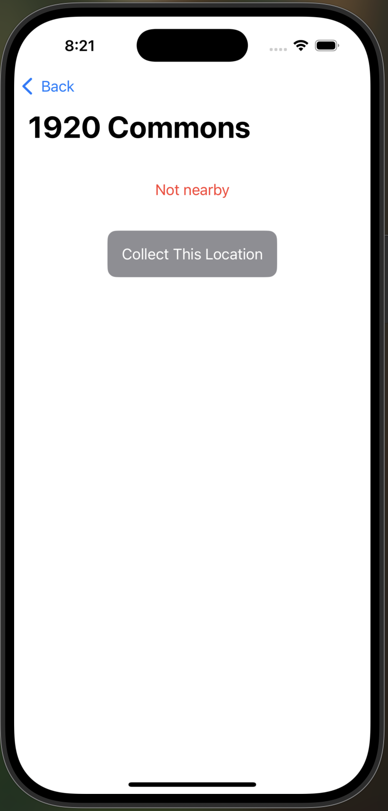

# Penn Dining Scavenger Hunt  

A location-based scavenger hunt game centered around Penn Dining halls. Using Core Location and Core Motion, this app allows users to collect dining halls when they're nearby by shaking their device!

---

## Features

### Home Screen

- Displays a list of Penn dining halls.  
- Shows collection status (collected or not).  
- Navigation to individual dining hall screens.

  

---

### Dining Hall Screen

- Prevents duplicate collection.  
- Checks if the user is within 50 meters of the dining hall using Core Location.  
- Allows collection using shake detection via accelerometer data (Core Motion).  

  
  
  

---

### Location Permission Priming

- Before requesting location permissions, the app presents a sheet explaining why access is needed, improving transparency and user trust.

  

---

### Location Simulation

- Supports simulated location using provided `.gpx` files via Xcode’s Debug > Simulate Location.

---

## Architecture

- **Model:** `DiningHall` struct with `id`, `name`, `isCollected`, and CLLocation.
- **ViewModel:** `DiningHallViewModel` tracks collected halls and business logic.
- **Views:** SwiftUI-based UI with `HomeView` and `DiningHallView`, sharing state via `@Environment` and a centralized `DiningHallViewModel`.

---

## How to Run

1. Open `PennDiningScavengerHunt.xcodeproj` in Xcode.
2. Run on a simulator or real device.
3. Simulate a dining hall location using `Debug > Simulate Location > Add GPX File to Project...`.
4. Tap on a dining hall in the list and shake the device to collect it.

---

## Notes

- Progress is not persisted across app launches.
- Coordinates are hardcoded using `Locations.swift`.
